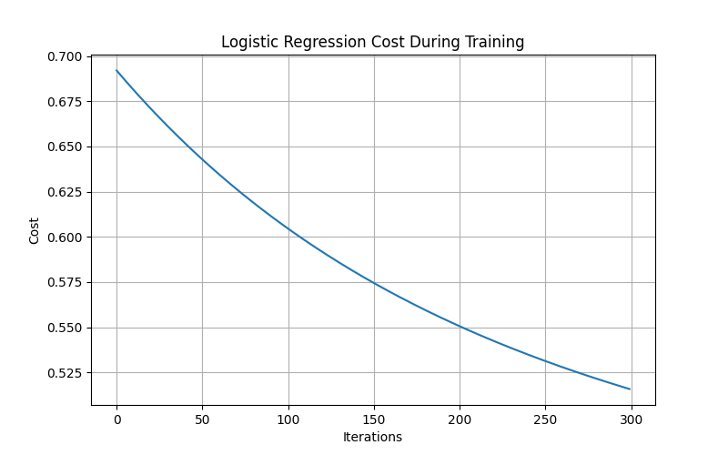

# Logistic Regression from Scratch

A complete implementation of **Binary Logistic Regression** from scratch using **NumPy**, without relying on machine learning libraries such as scikit-learn.

This project was built to deepen my understanding of the mathematical foundations of machine learning by implementing every component manually, including feature scaling, gradient computation, gradient descent optimization, and binary cross-entropy loss.

---

## Features

- Load and preprocess data using Pandas
- Handle missing values
- Train/Test data split
- Feature scaling using Z-score normalization
- Logistic Regression implemented from scratch
- Sigmoid activation function
- Binary Cross-Entropy (Log Loss)
- Gradient computation
- Gradient Descent optimization
- Prediction using a probability threshold
- Model evaluation using accuracy
- Cost function visualization

---

## Project Structure

```text
.
├── classification1.py
├── classification2.py
├── student-lifestyle-and-stress-dataset.csv
├── README.md
└── images
    └── cost_curve.png
```

---

## Mathematical Model

The logistic regression model first computes the linear combination of the input features:

\[
z = w^Tx + b
\]

The sigmoid function converts the result into a probability between 0 and 1:

\[
\sigma(z)=\frac{1}{1+e^{-z}}
\]

The predicted probability is

\[
P(y=1|x)=\sigma(z)
\]

where:

- **x** = input feature vector
- **w** = model weights
- **b** = bias
- **σ(z)** = predicted probability

---

## Cost Function

The model is trained by minimizing the Binary Cross-Entropy (Log Loss):

\[
J(w,b)=
-\frac1m
\sum_{i=1}^{m}
\left[
y^{(i)}\log(f_{w,b}(x^{(i)}))
+
(1-y^{(i)})
\log(1-f_{w,b}(x^{(i)}))
\right]
\]

This cost function measures how well the predicted probabilities match the true labels.

---

## Gradient Descent

The parameters are updated iteratively using Gradient Descent:

\[
w := w-\alpha\frac{\partial J}{\partial w}
\]

\[
b := b-\alpha\frac{\partial J}{\partial b}
\]

where:

- **α** = learning rate
- **w** = model weights
- **b** = bias term

Training continues until the cost function converges to a minimum.

---

## Dataset

This project uses the **Student Lifestyle and Stress Dataset**.

### Features

- Sleep Hours
- Study Hours
- Social Media Hours
- Attendance
- Exam Pressure
- Family Support
- Month

### Target

- Stress Level (Binary Classification)

---

## Training Results

The model was trained using Gradient Descent.

Example output:

```text
Initial Cost : 0.693147

Final Cost : 0.520000

Training Accuracy : 81.49%

Testing Accuracy : 81.53%
```

The steadily decreasing cost demonstrates that the optimization process successfully learned the model parameters.

---

## Cost During Training

The figure below shows how the cost decreases during Gradient Descent.

```markdown

```

> Replace `images/cost_curve.png` with your generated plot.

---

## Technologies Used

- Python
- NumPy
- Pandas
- Matplotlib

---

## Future Improvements

Possible extensions for this project include:

- L2 Regularization
- Confusion Matrix
- Precision
- Recall
- F1 Score
- ROC Curve
- Hyperparameter Tuning
- Feature Importance Analysis
- Multiclass Logistic Regression
- Fully Vectorized Implementation

---

## What I Learned

Building Logistic Regression from scratch helped me gain a deeper understanding of:

- Data preprocessing
- Feature scaling using Z-score normalization
- Logistic Regression
- Sigmoid activation function
- Binary Cross-Entropy Loss
- Gradient computation
- Gradient Descent optimization
- Binary classification
- Model evaluation using accuracy

Instead of relying on machine learning libraries, I implemented each step manually to better understand the mathematics behind the algorithm.

---

## Author

**Faezeh Nasirzadeh**

M.Sc. in Particle Physics | Machine Learning Enthusiast

GitHub: https://github.com/faezeh2983

LinkedIn: https://www.linkedin.com/in/faezeh-nasirzadeh-220597287/

---

## License

This project is licensed under the MIT License. Feel free to use, modify, and share it for educational purposes.
